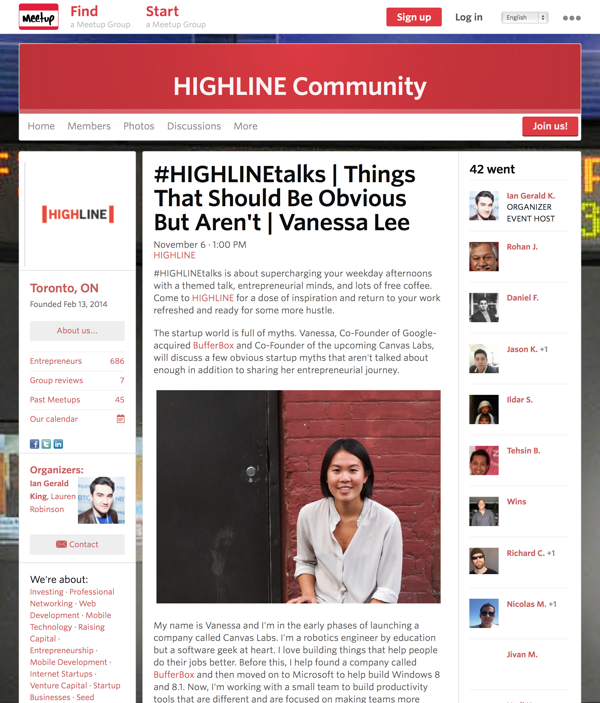

Last week, in the back alley behind my office building I took a few headshots of Vanessa Lee, Co-Founder of Canvas Labs.

 

Vanessa and I met earlier this year at Project Owl (a co-working space in Toronto) where we were both working. I was interested in her up coming project that she introduced at one of the demo events held by Project Spaces. 

 

After talking for a while about Vanessa stopping my the office (where I work 9-5ish) to show me how the web based note system was coming, I convienced her that she needed me to take a few headshoots, just encase she ever needed one. 

And she did. 

 