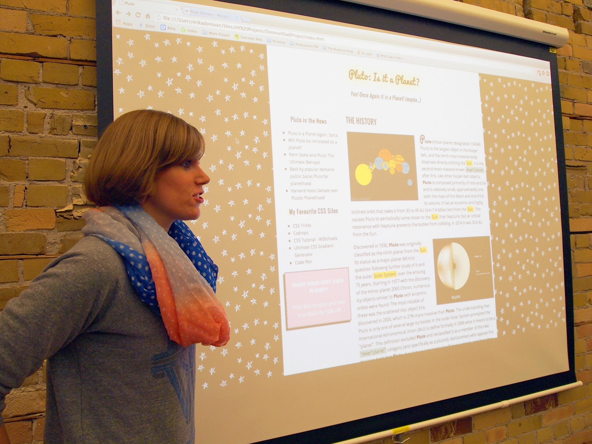

Last week we were given our first HackerYou class projects. I jumped at the idea of coding my very own one page website from scratch! Which I haven’t done in over 10 years. On Friday afternoon we had a work demo. Three of us had side projects we were working on that we wanted to share, and I showed them what I had made.

Well two of us did and one just wanted to demo how to use a beer funnel.

So I put my newly designed (following the list of items we needed to include) website up on the big screen for my co-workers, above, and then talked about it, showing what different things were and what I had learned in the first few weeks. I think they were impressed with it… or they are just really nice people that don’t want to put me down?

Anyways! I had a lot of fun building the basic one page site on my own. I asked our front end dev to not help me with it, but he did help me figure one thing out.

Saturday, I woke up with the thought of redoing it to make it so much better (and not about pluto). I figured just showing what I could do was great but why not make it look good too? And so that’s how I spent my Saturday morning; with a cup of coffee, my cat (DJ Frankie Fresh), and my laptop redesigning my project and submitted my work. And then I kept making changes to it… and then more…

You can view my project here (please note it is not mobile friendly yet), it will (might) be changing over time and one day will hopefully become my actual website that I coded all on my own! (not a copied one from a friend).