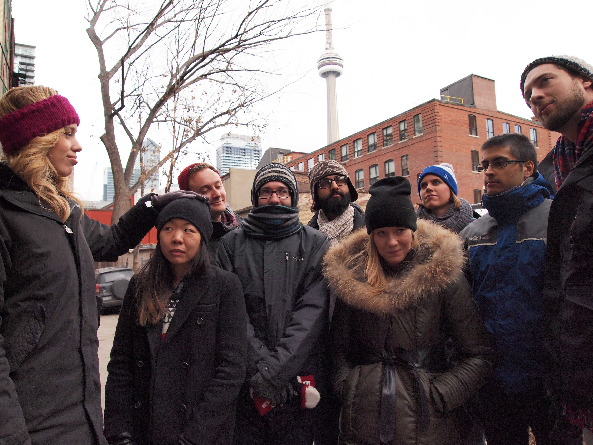
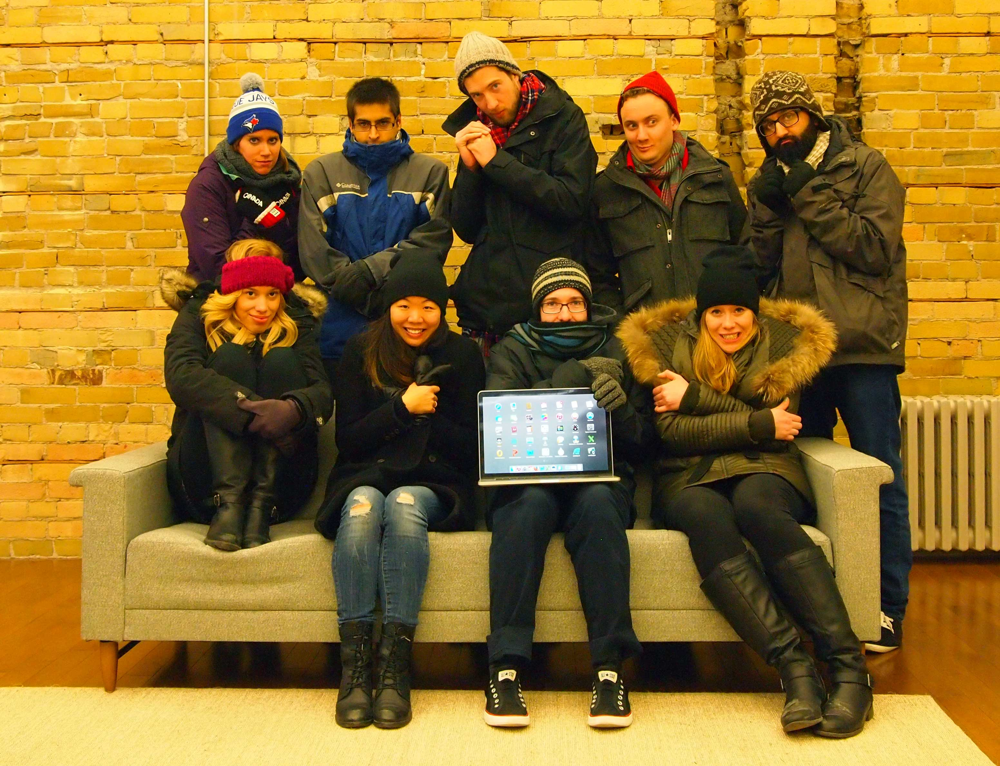

A few weeks ago I was asked to build the company Christmas Card page. Thankfully we have an amazing designer (Rachel) on staff who designed the page and all I had to do was take the team photo and build the web page. 

We started to go with a Home Alone theme card since one co-worker is based out of New York. We also planned to take a few shots inside since we have nice brick walls in the office. 

 

We tried a “we’re freezing inside” photo:

 

We tried a nice photo:

 

And a “we too tech-y for this” photo:

 

Rachel digitally added our New York team member on to the computer screen. You can check out the card <a href="https://theblueprint.com/christmas-card">here</a> and see what photo we went with (ps it plays music)!

Here is a bonus photo that was taken:

 
