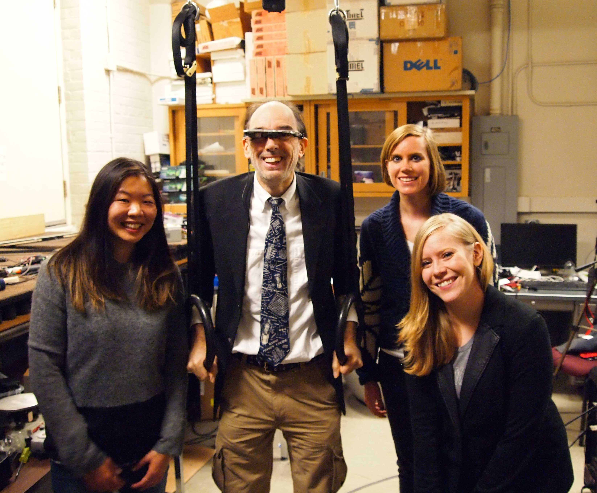
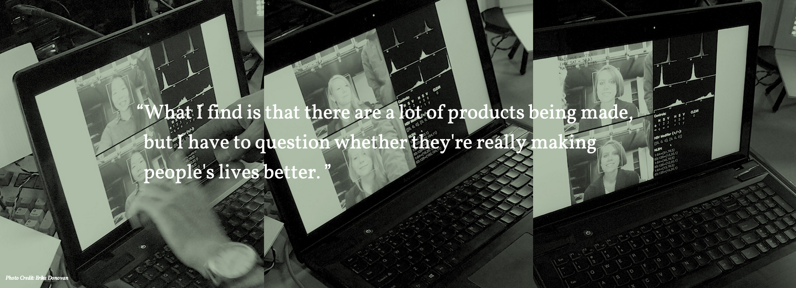
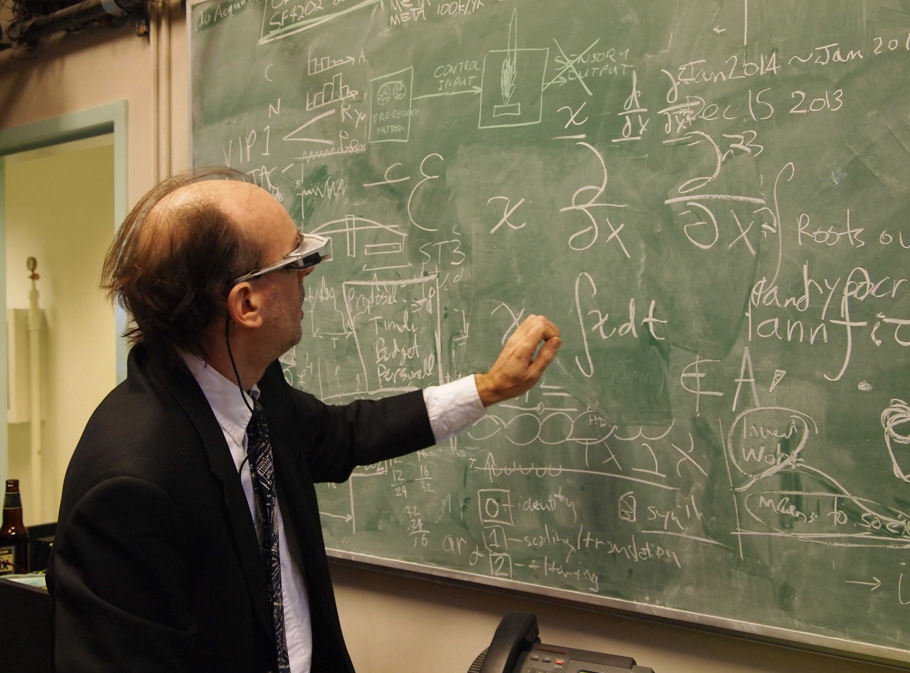
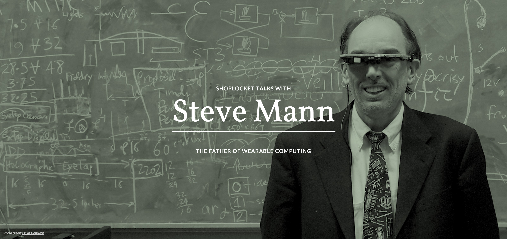

A month ago, in December, two co-workers and I made our way over to the University of Toronto campus to do an interview for our website series on Influencers and Founders. The person of interest today: Steve Mann. My job was to take photos of the research lab and profile photos of Steve Mann himself. Gwen was in charge of the interview portion and Rachel art-directed the whole thing! It was amazing! 

When we got there we received a tour of the research lab and was shown how a few of the gadgets worked, including the famous rings.

 

We even got to try out a prototype for portable lights what help correct the colour of your skin when using computer web cameras. 

(These photos were edited and put together for the interview by <a href="http://rachelma.ca/" title="Rachel Ma">Rachel Ma</a>)

Here is a photo of Steve Mann trying to teach us physics: 

At the end of the tour I took a couple of headshot type photos to use in the interview. Here is one that <a href="http://rachelma.ca/" title="Rachel Ma">Rachel</a> edited for the interview:

You can find the interview here: <a href="https://theblueprint.com/stories/steve-mann/" title="SHOPLOCKET TALKS WITH Steve Mann - THE FATHER OF WEARABLE COMPUTING" target="_blank">https://theblueprint.com/stories/steve-mann/</a> 
